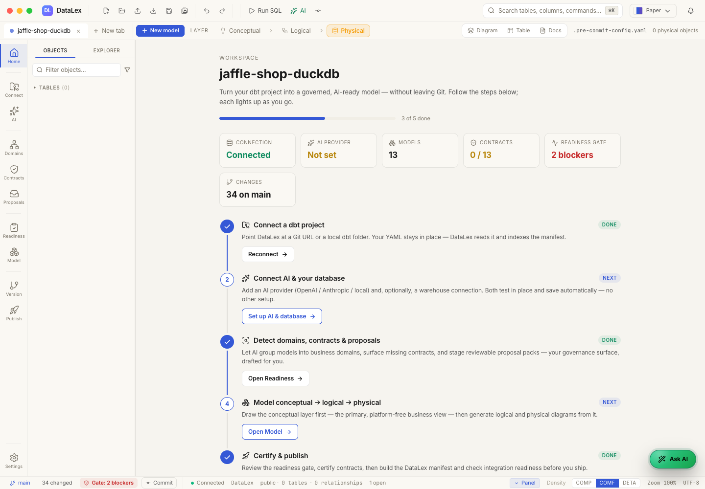
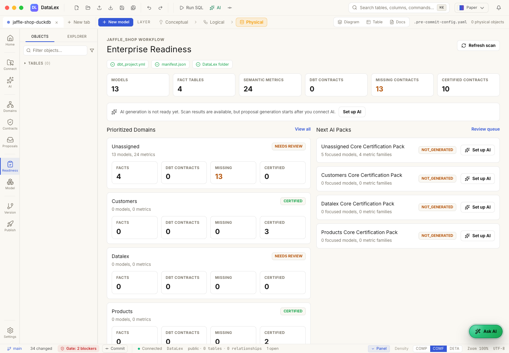
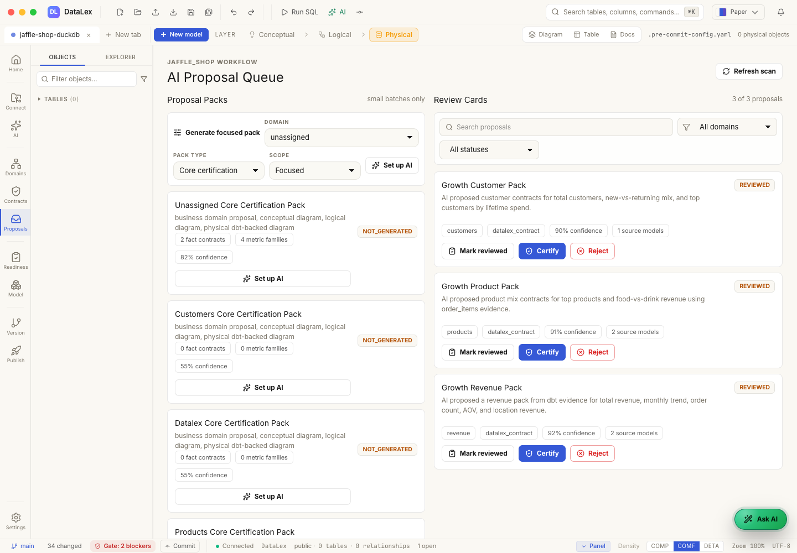
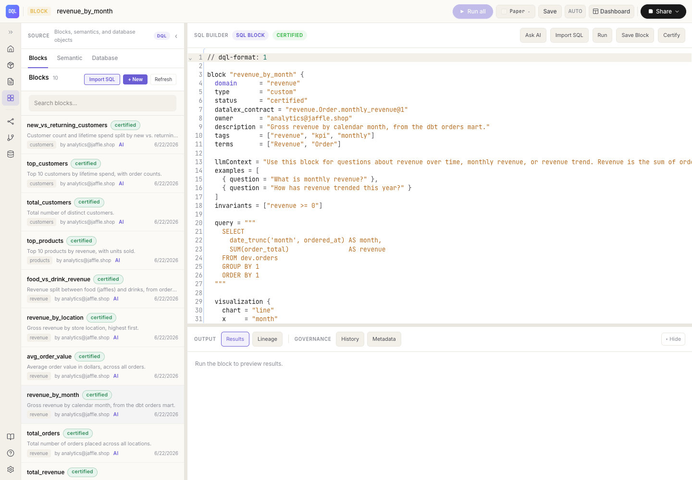
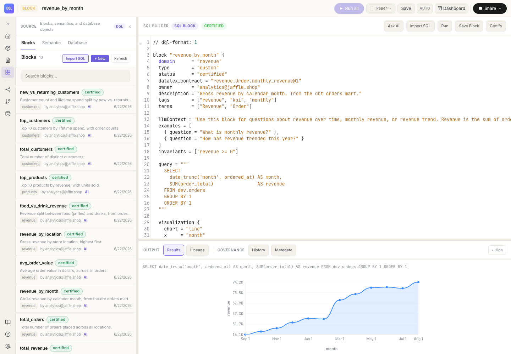
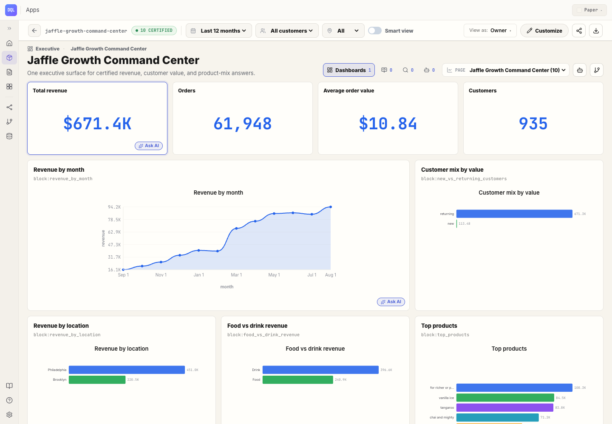
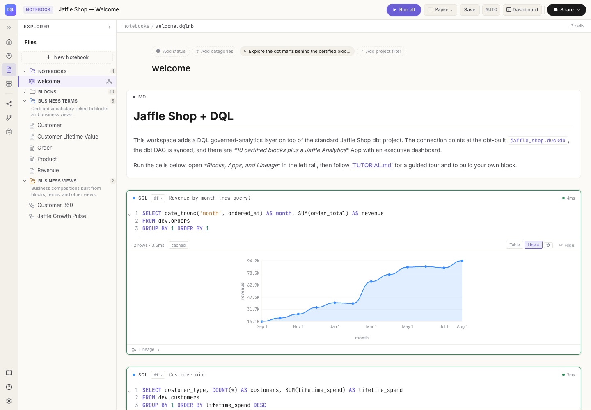
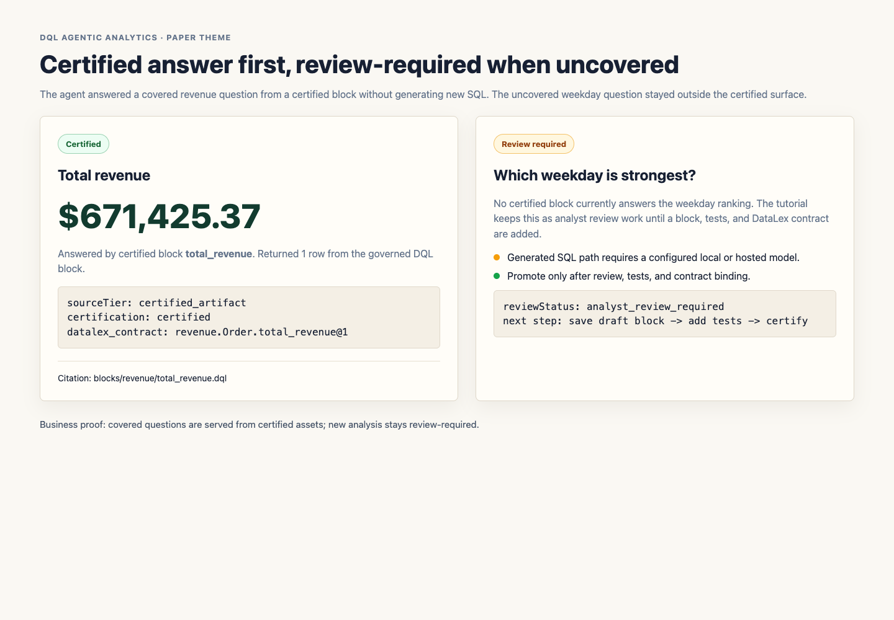
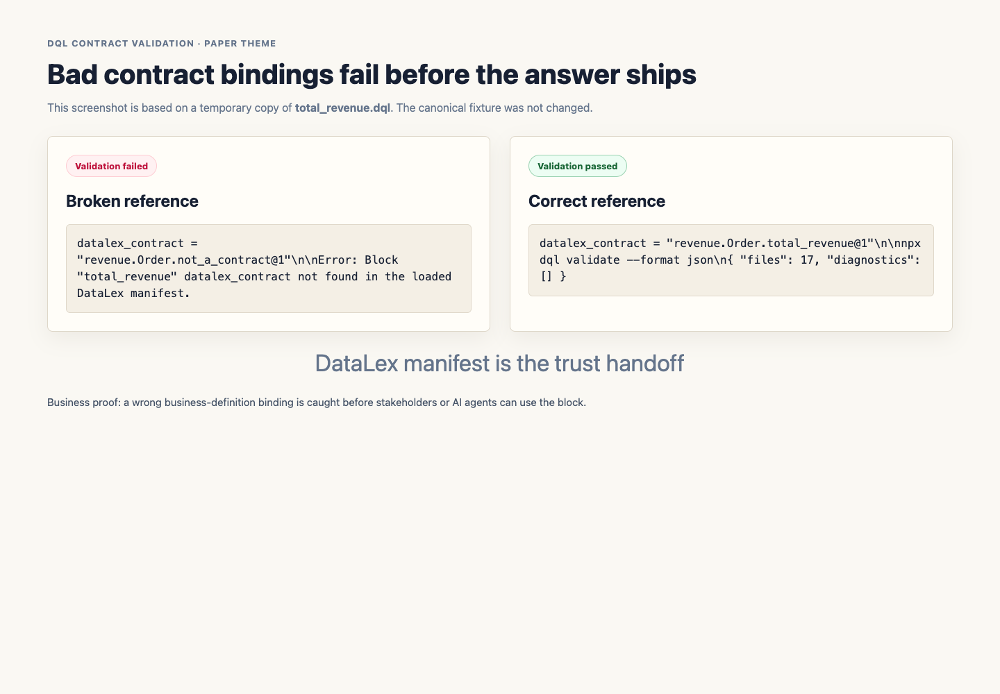

# Jaffle Shop Growth Command Center Tutorial

This repo is the single OSS example for the DataLex + DQL governed analytics
flow. The story is simple: Jaffle Shop leadership wants one trusted Growth
Command Center. AI can draft the work, but humans certify the business meaning
before DQL serves it to dashboards, notebooks, and agents.

The tutorial is intentionally AI-first in every chapter, followed by the manual
path users can edit, review, and commit.

## Setup

```bash
./setup.sh
datalex datalex manifest build DataLex --out "$(pwd)/DataLex/datalex-manifest.json"
cd dql
npm install
npx dql validate
npx dql app build
npx dql verify
npm run notebook
```

If you are running DataLex from a local source checkout, replace `datalex` with
the path to that checkout's executable.

Expected proof points:

- DataLex manifest: 3 domains, 3 entities, 10 certified contracts.
- DQL: 10 certified blocks, 10 `datalex_contract` bindings, 1 certified app.
- Lineage: sources -> dbt marts -> certified blocks -> Growth Command Center.

## Chapter 1. Jaffle Shop Growth Problem

Story: leadership asks why revenue is moving, which products drive growth, and
which customers matter most.

AI-first: ask DataLex to summarize the dbt project from evidence: marts,
semantic metrics, likely domains, missing owners, and candidate certified
answers.

Manual path: inspect `models/marts/orders.yml`, `models/marts/customers.yml`,
and `models/marts/order_items.yml`. The core story comes from orders,
customers, products, and item-level revenue.

Checkpoint: the user understands DataLex should start from dbt evidence, not a
blank model canvas.



*Business proof: DataLex reads the real dbt project before AI proposes business
meaning.*

## Chapter 2. Prepare dbt Evidence

Story: dbt owns transformations; DataLex should certify meaning from the
existing transformation graph.

AI-first: scan `target/manifest.json` and surface high-value marts:
`orders`, `customers`, `order_items`, `products`, and `locations`.

Manual path: run `./setup.sh`; confirm the DuckDB file exists; inspect dbt YAML
tests, descriptions, and semantic metrics.

Checkpoint: `target/manifest.json` exists and the dbt marts build cleanly.



*Business proof: readiness shows which dbt assets can support trusted
contracts and which gaps still need review.*

## Chapter 3. Generate the Growth Proposal Pack

Story: AI drafts a Growth Certification Pack for revenue, customers, and
products.

AI-first: generate proposals under:

- `DataLex/revenue/proposals/growth_revenue_pack.yaml`
- `DataLex/customers/proposals/growth_customer_pack.yaml`
- `DataLex/products/proposals/growth_product_pack.yaml`

Manual path: review each proposal's source models, columns, assumptions,
confidence, and open questions before accepting it.

Checkpoint: proposals are `status: reviewed`, not certified. They document the
AI draft, not the final trust boundary.



*Business proof: AI groups revenue, customer, and product evidence into
reviewable proposal packs instead of scattered suggestions.*

## Chapter 4. Review AI Proposals

Story: AI is fast, but not trusted until reviewed.

AI-first: ask AI to explain each proposed contract in business language: grain,
source model, approved measures, risks, and open questions.

Manual path: edit contract YAML for owner, source model, grain, signature
outputs, assumptions, and review cadence.

Checkpoint: every contract can be explained to a stakeholder without exposing
SQL first.


*Business proof: confidence, assumptions, source models, and changed files are
visible before certification.*

## Chapter 5. Certify DataLex Contracts

Story: certification turns "AI suggested this" into "the analytics team accepts
this definition."

AI-first: ask DataLex to check whether each contract is business-readable and
grounded in dbt evidence.

Manual path: mark reviewed contracts `status: certified` only after source
models, measures, dimensions, and required tests make sense.

Checkpoint: 10 certified contracts exist across revenue, customers, and
products.


*Business proof: certified means accepted business meaning, not merely generated
YAML.*

## Chapter 6. Publish the DataLex Manifest

Story: the manifest is the trust handoff into DQL and AI agents.

AI-first: ask DataLex to summarize what entered the manifest and what stayed in
review-only proposal files.

Manual path:

```bash
datalex datalex manifest build DataLex --out "$(pwd)/DataLex/datalex-manifest.json"
```

Checkpoint: the manifest contains certified contracts only; reviewed proposals
do not leak into the DQL trust surface.


*Business proof: the manifest is the clean handoff from DataLex certification
to DQL execution.*

## Chapter 7. Connect DQL to DataLex

Story: DQL should execute trusted answers only when they bind to certified
business meaning.

AI-first: ask DQL to map blocks to contract ids. Example:
`revenue_by_month` maps to `revenue.Order.monthly_revenue@1`.

Manual path: `dql/dql.config.json` points to `../DataLex/datalex-manifest.json`,
and every certified block includes a `datalex_contract` reference.

Checkpoint:

```bash
cd dql
npx dql validate --format json
```

Expected result: zero diagnostics.



*Business proof: a certified DQL block names the exact DataLex contract it
implements.*

## Chapter 8. Generate Certified DQL Blocks

Story: repeated stakeholder questions become reusable answer units.

AI-first: generate blocks for total revenue, monthly revenue, AOV, order count,
customer count, customer value, product mix, and location performance.

Manual path: review SQL, metadata, tests, `llmContext`, `terms`, and
`datalex_contract` before keeping `status = "certified"`.

Checkpoint: `npx dql compile` emits a manifest with 10 certified blocks and
contract-bound lineage.



*Business proof: governed definitions still execute against the local DuckDB
data and return inspectable results.*

## Chapter 9. Build the Growth Command Center App

Story: executives need one clean surface, not scattered SQL.

AI-first: generate an App plan from the certified blocks.

Manual path: review `dql/apps/jaffle-analytics/dql.app.json` and
`dql/apps/jaffle-analytics/dashboards/overview.dqld`. Every tile should point
to a certified block, not inline SQL.

Checkpoint:

```bash
npx dql app build
```

Expected result: 1 app, 1 dashboard, no unresolved references.



*Business proof: stakeholders get one executive surface while analytics keeps
ownership in certified files.*

## Chapter 10. Notebook Research to Certified Block

Story: analysts explore new questions before they become certified assets.

AI-first: ask "which weekday sells most?" or "which products drive repeat
customers?" and let the notebook draft review-required SQL.

Manual path: inspect the SQL, save a draft block, add tests and a DataLex
contract, then certify once reviewed.

Checkpoint: the tutorial shows a research answer as draft until a human
promotes it.



*Business proof: exploration is allowed, but it stays outside the certified
surface until reviewed.*

## Chapter 11. Governed Agentic Analytics

Story: AI answers from certified blocks when possible and labels generated SQL
as review-required when a question is not covered.

AI-first:

```bash
npx dql agent reindex
npx dql agent ask "what is total revenue?"
npx dql agent ask "which weekday is strongest?"
```

Manual path: inspect draft output, decide whether it deserves a contract and a
block, and promote only reviewed work.

Checkpoint: covered questions cite certified blocks; uncovered questions remain
review-required.



*Business proof: AI answers covered questions from certified assets and labels
new analysis as review-required.*

## Chapter 12. Trust Failure and Fix

Story: governance matters because bad contract bindings should fail before
stakeholders see them.

AI-first: ask the agent to explain a failing contract reference and suggest the
nearest valid contract id.

Manual path: temporarily change one block to a bad `datalex_contract`, run
`npx dql validate`, fix the id, and rerun validation.

Checkpoint: the failure is visible at validation time, before the app or MCP
serves the answer.



*Business proof: bad contract references fail before stakeholders or AI agents
can consume the answer.*

## Chapter 13. CI and OSS Adoption

Story: trust must survive pull requests, not just a local demo.

AI-first: generate a PR summary of changed DataLex contracts, DQL blocks, app
pages, and lineage impact.

Manual path:

```bash
dbt build --profiles-dir . --exclude resource_type:seed
datalex datalex validate DataLex
datalex datalex manifest build DataLex --out "$(pwd)/DataLex/datalex-manifest.json"
cd dql
npx dql validate
npx dql app build
npx dql verify
```

Checkpoint: a contributor can clone the repo, run the same gates, and trust the
manifest they produce.

## Screenshot Assets

All screenshots use the Paper theme and live in this example repo so DataLex and
DQL remain product repos without embedded example pages.

- Docs captures: `docs/assets/tutorials/jaffle/datalex/` and
  `docs/assets/tutorials/jaffle/dql/` at `1440x1000`.
