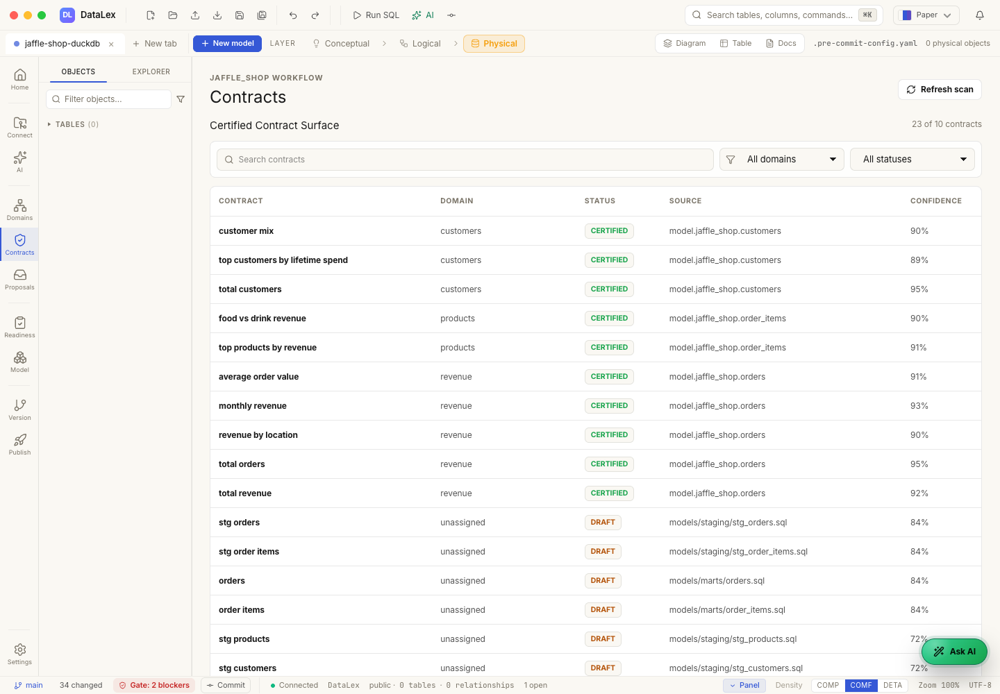

# Chapter 5 — Certify DataLex Contracts

[← Previous: Review AI Proposals](04-review-ai-proposals.md) | [Next: Publish Manifest →](06-publish-manifest.md)

## Story Context

**Certification is the moment the data team accepts the definition.** It is not
a UI badge for "AI generated this." It means the business meaning is reviewed
and ready to be reused.

## Business Value

Certified contracts give downstream tools a stable language for trusted
answers. DQL can bind blocks to those contract ids, and agents can cite governed
meaning instead of improvising definitions.

## AI-First Workflow

Ask DataLex to check whether each contract is:

- business-readable
- grounded in dbt evidence
- specific about grain and outputs
- clear about assumptions
- narrow enough to certify

## Manual Review Path

Set `status: certified` only after the reviewer confirms:

- source model and fields are correct
- measure logic matches the business definition
- dimensions are safe to expose
- tests or validation expectations are present
- assumptions are explicit

## Files to Inspect

- `DataLex/revenue/contracts/`
- `DataLex/customers/contracts/`
- `DataLex/products/contracts/`
- `DataLex/domains/`

## Checkpoint

The tutorial has 10 certified contracts across revenue, customers, and products.

**Business proof:** certified means accepted business meaning, not merely
generated YAML.

[← Previous: Review AI Proposals](04-review-ai-proposals.md) | [Next: Publish Manifest →](06-publish-manifest.md)
