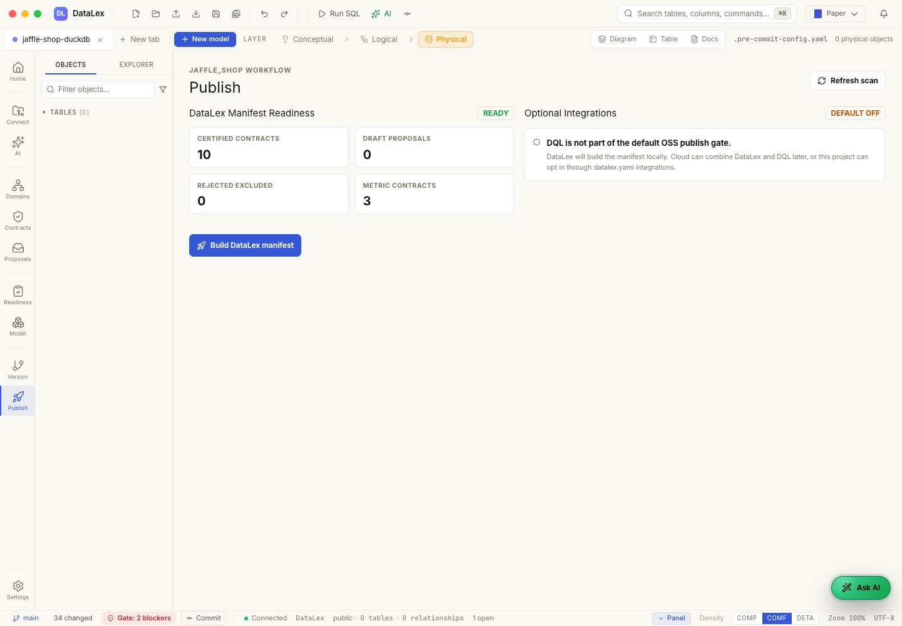

# Chapter 6 — Publish the DataLex Manifest

[← Previous: Certify Contracts](05-certify-contracts.md) | [Next: Connect DQL to DataLex →](07-connect-dql-to-datalex.md)

## Story Context

**The manifest is the trust handoff.** DataLex can contain proposals, glossary,
drafts, and reviewed contracts, but DQL should consume only the certified
business definitions.

## Business Value

The manifest gives other tools a stable, versioned artifact. It separates
internal review work from the definitions that are allowed to power certified
answers.

## AI-First Workflow

Ask DataLex to summarize:

- which contracts entered the manifest
- which proposals stayed out
- what domains and entities are covered
- what still needs future certification

## Manual Review Path

Build the manifest:

```bash
datalex datalex manifest build DataLex --out "$(pwd)/DataLex/datalex-manifest.json"
```

If you are using a local DataLex source checkout, replace `datalex` with that
checkout's executable path.

## Files to Inspect

- `DataLex/datalex-manifest.json`
- `DataLex/datalex.yaml`
- `DataLex/domains/revenue.yaml`
- `DataLex/domains/customers.yaml`
- `DataLex/domains/products.yaml`

## Checkpoint

The manifest reports 3 domains, 3 entities, and 10 certified contracts.
Reviewed proposal files do not leak into the trusted DQL surface.



**Business proof:** the manifest is the clean handoff from DataLex certification
to DQL execution.

[← Previous: Certify Contracts](05-certify-contracts.md) | [Next: Connect DQL to DataLex →](07-connect-dql-to-datalex.md)
