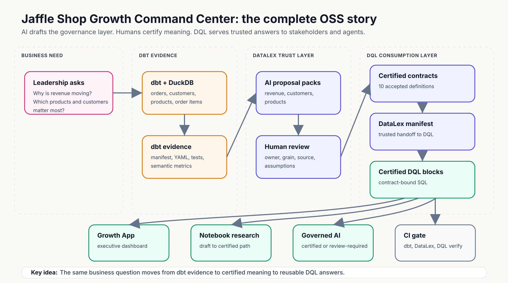

# Jaffle Shop Growth Command Center

This is the canonical OSS tutorial for the combined **DataLex + DQL** governed
analytics flow. It uses this repo as one complete business story:

**Jaffle Shop leadership wants a trusted Growth Command Center.** They need to
understand revenue, customers, and products without debating which SQL query is
correct. DataLex uses AI to draft the business governance layer from dbt
evidence. Humans review and certify the meaning. DQL turns those certified
definitions into reusable blocks, notebooks, an executive App, and governed AI
answers.

## The Trust Flow

> Click the diagram to open the full-size SVG in a browser tab, where you can
> zoom or use full-screen mode.

<p align="center">
  <a href="../../assets/architecture/jaffle-flow.svg">
    
  </a>
</p>

## Setup

Run the setup once from the repo root. It installs the latest dbt, DataLex, and
DQL tooling, builds the models, publishes the DataLex manifest, and runs the DQL
gate — in that order:

```bash
./setup.sh
cd dql && npm run notebook     # http://127.0.0.1:3474
```

Prefer Docker? `docker compose up --build` does the same with no local Python or
Node toolchain. See the [root README](../../../README.md#run-with-docker).

To run the steps by hand, `datalex` is the CLI that `setup.sh` installs into the
project `.venv` (`pip install datalex-cli`), so activate it first:

```bash
source .venv/bin/activate
datalex datalex manifest build DataLex --out "$(pwd)/DataLex/datalex-manifest.json"
cd dql
npm install
npx dql validate
npx dql app build
npx dql verify
npm run notebook
```

If you are running DataLex from a local source checkout instead, replace
`datalex` with that checkout's executable path.

**Expected proof points**

- **DataLex manifest:** 3 domains, 3 entities, 10 certified contracts.
- **DQL layer:** 10 certified blocks, 10 `datalex_contract` bindings, 1 certified App.
- **Lineage:** raw sources -> dbt marts -> certified blocks -> Growth Command Center.

## Chapters

| Chapter | What the user learns | Main proof |
| --- | --- | --- |
| [1. Jaffle Shop Growth Problem](01-growth-problem.md) | Why governance matters for growth questions. | DataLex starts from dbt evidence. |
| [2. Prepare dbt Evidence](02-prepare-dbt-evidence.md) | dbt is the source of transformation truth. | Manifest, marts, tests, and metrics are ready. |
| [3. Generate the Growth Proposal Pack](03-generate-proposal-pack.md) | AI drafts business domains from evidence. | Proposal packs are reviewable files. |
| [4. Review AI Proposals](04-review-ai-proposals.md) | AI output is not trusted until reviewed. | Assumptions and changed files are visible. |
| [5. Certify DataLex Contracts](05-certify-contracts.md) | Certification means accepted business meaning. | 10 contracts become certified. |
| [6. Publish the DataLex Manifest](06-publish-manifest.md) | The manifest is the trust handoff. | Certified contracts only enter the manifest. |
| [7. Connect DQL to DataLex](07-connect-dql-to-datalex.md) | DQL blocks bind to certified contract ids. | Validation resolves `datalex_contract`. |
| [8. Generate Certified DQL Blocks](08-certified-dql-blocks.md) | Repeated questions become reusable answers. | Blocks run against DuckDB and validate. |
| [9. Build the Growth Command Center App](09-growth-command-center-app.md) | Executives need one clean surface. | App tiles point to certified blocks. |
| [10. Notebook Research to Certified Block](10-notebook-research-to-certified-block.md) | Research stays draft until reviewed. | Notebook output has a promotion path. |
| [11. Governed Agentic Analytics](11-governed-agentic-analytics.md) | AI answers certified questions first. | Covered vs uncovered questions are labeled. |
| [12. Trust Failure and Fix](12-trust-failure-and-fix.md) | Bad bindings fail before users see them. | Broken contract refs are caught. |
| [13. CI and OSS Adoption](13-ci-and-oss-adoption.md) | Trust must survive pull requests. | dbt, DataLex, DQL gates pass. |

## Reading Pattern

Each chapter follows the same shape:

- **Story context:** what Jaffle Shop is trying to decide.
- **Business value:** why the step matters to a stakeholder.
- **AI-first workflow:** what AI should draft or explain.
- **Manual review path:** what the human edits, validates, and commits.
- **Files to inspect:** the concrete repo artifacts.
- **Checkpoint:** how to know the step worked.

Start with [Chapter 1 — Jaffle Shop Growth Problem](01-growth-problem.md).
